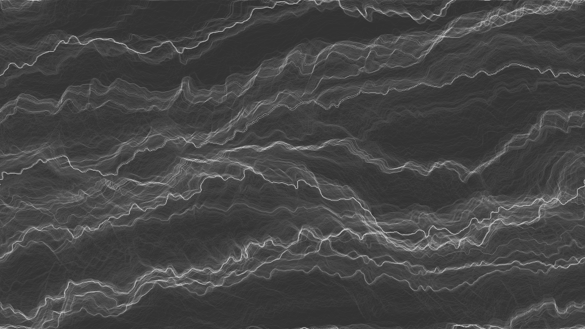

# Processing Perlin Flow Field

Creating a flow field with Perlin noise in processing.

Based on [the Coding Train's tutorial](https://thecodingtrain.com/CodingChallenges/024-perlinnoiseflowfield.html).
